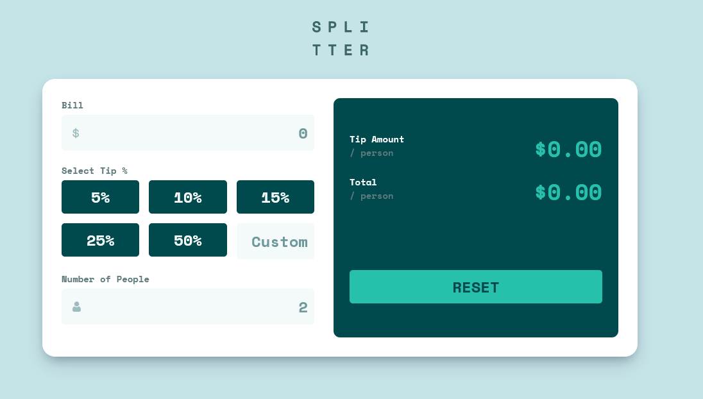

This is a solution to the [Tip calculator app challenge on Frontend Mentor](https://www.frontendmentor.io/challenges/tip-calculator-app-ugJNGbJUX).

## Table of contents

- [Overview](#overview)
  - [The challenge](#the-challenge)
  - [Screenshot](#screenshot)
  - [Links](#links)
- [My process](#my-process)
  - [Built with](#built-with)
  - [What I learned](#what-i-learned)

**Note: Delete this note and update the table of contents based on what sections you keep.**

## Overview

### The challenge

Users should be able to:

- View the optimal layout for the app depending on their device's screen size
- See hover states for all interactive elements on the page
- Calculate the correct tip and total cost of the bill per person

### Screenshot

### Links

- [Repository URL](https://github.com/humbruno/tip-calculator)
- [Live Site URL](https://humbruno.github.io/tip-calculator/)

## My process

### Built with

- Semantic HTML5 markup
- SCSS
- Flexbox
- CSS Grid
- JavaScript
- Gulp workflow

### What I learned

Quite a challenging one! The math formula side of things was a bit of a headache, but I definitely struggled the most with switching active states between buttons, and updating the total amounts on the right side as the inputs are changed!

I feel proud of the end result but definitely feel that my JavaScript could be a bit more compact and separated into more reusable components, something to keep in mind for next project!
